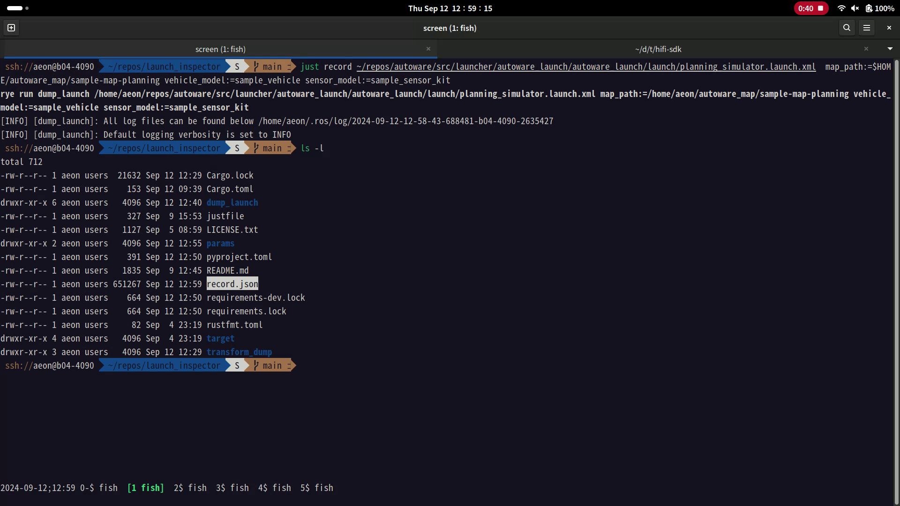

# ROS2 Launch Inspection Tool

This project provides tools to record the execution of ROS 2
launch. Then, analyze and replay the launch execution.

[](demo.webm)

## Prerequisites

- Rust toolchain

  Visit [rustup.rs](https://rustup.rs/) and install `rustup`.

- rye

  Visit [rye.astral.sh](https://rye.astral.sh/) to install it. It is
  used to setup a Python virtual environment and to manage Python
  project.


- just

  Read the [book](https://just.systems/man/en/) and follow
  installation instructions. It enables us to use `justfile`, a modern
  version of `Makefile`.

- procpath

  Visit the [pypi site](https://pypi.org/project/Procpath/) to install
  this tool. This is used for resource usage profiling.

## Usage

### Record a Launch Execution

This example analyzes the launch file to run Autoware planning
simulation and generates `record.json` dump. This dump file records
all nodes and parameters to perform the simulation.

```sh
just record \
  /path_to_autoware/src/launcher/autoware_launch/autoware_launch/launch/planning_simulator.launch.xml \
  map_path:=$HOME/autoware_map/sample-map-planning vehicle_model:=sample_vehicle \
  sensor_model:=sample_sensor_kit
```

### Play the Launch

This command loads the `record.json` and perform the launch execution.

```sh
just play
```

(Optional) You can generate the shell script used to execute the
launch.

```sh
just generate_script
```

## Profiling Resource Usage

Start the launch first by `just play`. Then, run this command to
profile per-process resource usage into `profiling.sqlite` database
file. Press Ctrl-C to terminate the profiling.

```sh
just profile
```

Afterwards, you can generate SVG timecharts using this command.

```sh
just plot
```

## License

This software is distributed under MIT license. You can read the
[license file](LICENSE.txt).
