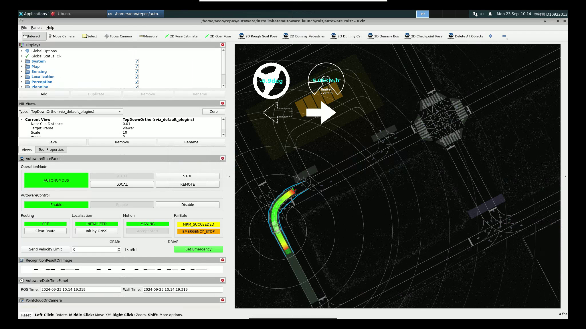

# ROS2 Launch Inspection Tool

This project provides tools to record the execution of ROS 2
launch. Then, analyze and replay the launch execution.

[](demo.webm)


## Install Pre-built Packages (Recommended)

Find the latest pacakges in the [Release
page](https://github.com/NEWSLabNTU/ros-launch-perf/releases) and
follow the instructions.


## Install from Source

### Prerequisites

- Rust toolchain

  Visit [rustup.rs](https://rustup.rs/) and install `rustup`.

- uv

  Visit [docs.astral.sh/uv](https://docs.astral.sh/uv/) to install it. It is
  used to setup a Python virtual environment and to manage Python
  project.


- procpath

  Visit the [pypi site](https://pypi.org/project/Procpath/) to install
  this tool. This is used for resource usage profiling.


### Build This Project

Clone the project Git repository.

```sh
git clone https://github.com/NEWSLabNTU/ros-launch-perf.git
```

Compile the project and install the `dump_launch` and `play_launch`
commands on the system.

```sh
make install
```

You can uninstall these commands afterwards.

```sh
make uninstall
```


## Usage

The workflow goes in the **dump** step and then the **play** step. The
dump step cans the launch file and creates a `record.json`. The play
step reads the dump and executes the launch plan. The dump only needs
to be done once.

### Step 1: Record a Launch Execution

The dump step runs in the same way we run a launch file. In this
Autoware simulation example, simply replace `ros2 launch` with
`dump_launch`.

```sh
## This is the original launch command.
# ros2 launch \
#     autoware_launch planning_simulator.launch.xml \
#     map_path:=$HOME/autoware_map/sample-map-planning \
#     vehicle_model:=sample_vehicle sensor_model:=sample_sensor_kit

dump_launch \
    autoware_launch planning_simulator.launch.xml \
    map_path:=$HOME/autoware_map/sample-map-planning \
    vehicle_model:=sample_vehicle sensor_model:=sample_sensor_kit
```

### Step 3: Play the Launch Record

This command loads the `record.json` and perform the launch execution.

```sh
play_launch
```

## Profiling Resource Usage

Start the launch first by `just play`. Then, run this command to
profile per-process resource usage into `profiling.sqlite` database
file. Press Ctrl-C to terminate the profiling.

```sh
make profile
```

Afterwards, you can generate SVG timecharts using this command.

```sh
make plot
```

## License

This software is distributed under MIT license. You can read the
[license file](LICENSE.txt).
